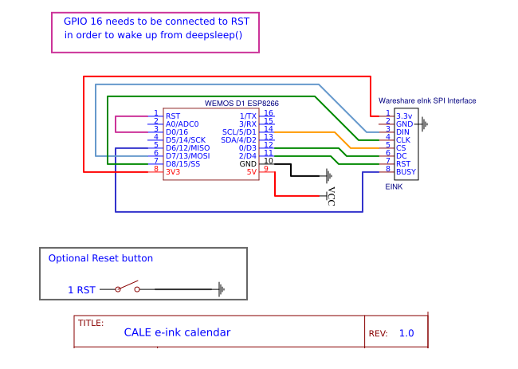

# CALE E-ink calendar

A very easy and straight-forward Eink calendar. 
At the moment just has 3 simple options:

1. Renders a screenshot of a webpage. A calendar if you point it to a page rendering it's contents.
2. Renders a free title + text
3. Cleans screen

If you have an OS with Bonjour enabled multicast DNS discovery OS like mac or linux it should be possible to access also browsing: calendar.local

### Our approach to make an easy E-Ink calendar

- A screenshot to BMP endpoint that prints a webpage with the contents you need displayed on Eink
- The Firmware driving the Eink display will wake up every morning or every 2 hours and read this screenshot. Then it will stay in deep sleep mode, consuming 1 miliamper from the battery, until it wakes up again and repeats the loop. 
- [CALE.es](https://cale.es) will prepare for you a bitmap url so you can simply copy and paste it in Config.h configuration file

### Simple configuration

Just rename lib/Config/Config.h.dist to Config.h
and fill it with your WiFi name and password.

If you want to enable deepsleep to power your calendar with batteries, then uncomment the line:

    //#define DEEPSLEEP_ENABLED

Amount of seconds that the ESP32 is awake:

    #define SLEEP_AFTER_SECONDS 20 

Note that ESP8266 uses another function to deepsleep and has a maximun deepsleep time of about 3 hours:

    ESP.deepSleep(3600e6);  // 3600 = 1 hour in seconds

**Most important part of the configuration:**

    char screenUrl[] = "http://img.cale.es/bmp/USERNAME/SCREEN_ID";
    
    // Security setting, leave empty if your screen is publis
    String bearer = "";

Note that we don't recommend to use public screens since your calendar may contain private information like events, transfer or doctor appointments that you should not open to the world to see. So use always a security token.

This token is sent in the headers like:

Authorization: Bearer YOUR_TOKEN

And passed to cale.es that verifies that your user owns this screen and also that the token matches the one that is stored on our servers.

### Schematics

#### ESP32 wiring suggestion

Mapping suggestion for ESP32, e.g. LOLIN32:
    This pins defined in lib/Config/Config.h
    BUSY -> 4, RST -> 16, DC -> 17, CS -> SS(5)  

    This ones are fixed
    CLK -> SCK(18), DIN -> MOSI(23)

### Build logs and detailed instructions

[CALE in Hackaday](https://hackaday.io/project/169086-cale-low-energy-eink-wallpaper) Please follow the project there to get updates and more detailed build instructions.

### Support CALE

There are commercial solutions alike and they start up to 500€ for a Eink syncronized calendar (Check getjoan.com)
If you use this commercially in your office we want to ask you about a small donation and to send us a short history of how it's working so we can give support. Please also file a Github issue in case you find a bug with detailed instructions so we can reproduce it in our end. 
